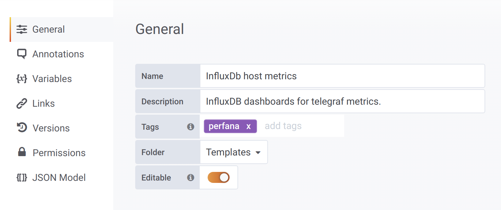
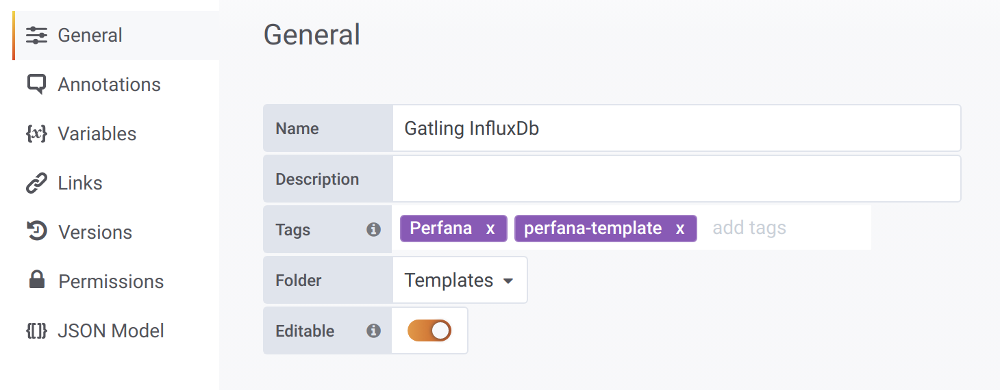

# Administration
{: .no_toc }

## Table of contents
{: .no_toc .text-delta }

1. TOC
{:toc}

---

## Grafana configuration

As an `admin` user you can maintain the Grafana configuration in Perfana. To do so open the `Grafana configuration` from the `Admin` section of the sidebar.

It is possible to add multiple Grafana instances, to add one click on the `Add Grafana instance` button, this will open the `Add Grafana instance` form with these fields:

* **Label**: add descriptve name for this Grafana instance
* **Url to connect from client**: The grafana url that your browser uses to connect to the Grafana instances
* **Url to connect from server**: *Optional* Url to connect to Grafana instance from Perfana server side. For instance the service name when both Perfana and Grafan are running in Kubernetes.
* **Grafana Organisation ID**
* **Grafana API key**: API key with admin role, see [Grafana documentation](https://grafana.com/docs/grafana/latest/http_api/auth/#create-api-token)
* **Username**: Username for Grafana admin user
* **Password**
* **Use this Grafana instance to store all snapshots**: if checked this Grafana instance will be used to store snapshots.
* **Use this Grafana instance to host the Perfana dashboards**: if checked, Perfana will use this instance for hosting Perfana dashboards for trends and profile check results.

The `Grafana configuration` view will show you one or more Grafana instances and for each dashboard the dashboards that have been registered in Perfana. To register a Grafana dashboard is Perfana is simple: just add a `perfana` tag to the dashboard:

The `grafana-perfana` service will now automatically register the dashboard in Perfana and will update it when changes are made. If the dashboard is deleted from Grafana by mistake, the `grafana-perfana` will restore it. 

--- 
> If you use the `delete` icon in the `Linked dashboards` section, the dashboard will be deleted in both Perfana and Grafana!
---
## Teams configuration

Perfana allows admin users to create `Teams` to efficiently organise the test run data. `Teams` consist of one or more `team members` and a `system under test` is linked to one `team`.

To mantain the configured `Teams` an `admin` user can open the `Teams` item from the `Admin` section of the sidebar.

A new `Team` can be added by clicking the `Add team` button, this will open the `Add team` from with these fields:

* **Organisation**: select Organisation
* **Name**
* **Description**: *optional* Add description for the team

Click the `team` row to view the team members and the systems under test linked to this team.

A team has one or more `team members` and `users` can be member of one or more `teams`. To add `team members` click on the select box to select one or more users.

A `team` can be responsible for one or more `systems under test`, but a `system under test` is linked to one `team` only. To link `system under tests` to the selected team, select one or more via the select box.

---
> When you link a `system under test` to a `team` that was already linked to another team, it will no longer be linked to the other team!
---
## Profiles configuration

Perfana profiles can be used to automatically configure test runs. By passing `tags` via the Gatling script [pom.xml](https://github.com/perfana/perfana-gatling-afterburner/blob/master/pom.xml#L252) profiles can be activated for test runs with the provide properties and the following configuration can automatically be added:

### Grafana dashboards

Profiles can be used to automatically link Grafana dashboards to test runs. To use a Grafana dashboard for autoconfiguration it has to be tagged in Grafana as `perfana-template`

To add a template dashboard to a `profile`, click on `Add dashboard` to open the form with these fields:

* **Profile**
* **Grafana**: Select the Grafan instance that hosts the template dashboard
* **Dashboard name**: select the template dashboard
* **Create separate dashboard for variable**: *optional* if a templating variable is selected, a separate Grafana dashboard will be created for each distinct value that is found for that templating variable.

---
> In order to make this feature work the metric data has to be labeled with tags `system_under_test` and `test_environment` and the Grafana dashboard has to use templating variables for these properties, as can be seen [here](http://localhost:3000/d/template-gatling-influx/gatling-influxdb?editview=templating&orgId=1&theme=light) (requires demo environment to be running)
---
* **Set hardcoded value for variables**: *optional* use this to set hardcoded values for the available templating variables (except for `system_under_test` and `test_environment`)
* **Match regex for variables**: *optional* use this to only add the dashboard when a value for the selected templating value matches the provided regular expression.

### Key metrics

For the any of the Grafana dashboards added to the `profile` it is possible to automatically add `key metrics` to test runs that are tagged with the `profile` name.

--- 
> This feature can be used to set ***enterprise-wide*** requirements for specific metrics. The check results are recorded and the results can be viewed over time aggregated by `team` and `system under test`
--- 

To add a `key-metric` to a `profile` click `Add metric`. Learn [here](https://perfana.github.io/perfana-docs/docs/testconfiguration/testconfiguration.html#add-key-metric) how to add a key metric.

### Reporting panel

A `profile` can also be used to specify a reporting template for test runs with matching tags.

--- 
> This feature can be used to create a ***enterprise-wide uniform reporting standard***, for instance for formal release tests reports.
--- 
To add a `report panel` to the `reporting template` fo a `profile` click `Add panel`. Learn [here](https://perfana.github.io/perfana-docs/docs/testconfiguration/testconfiguration.html#reporting-template) how to add a `report panel`.

## Data retention and test run expiry

## Quality gate

## Settings

