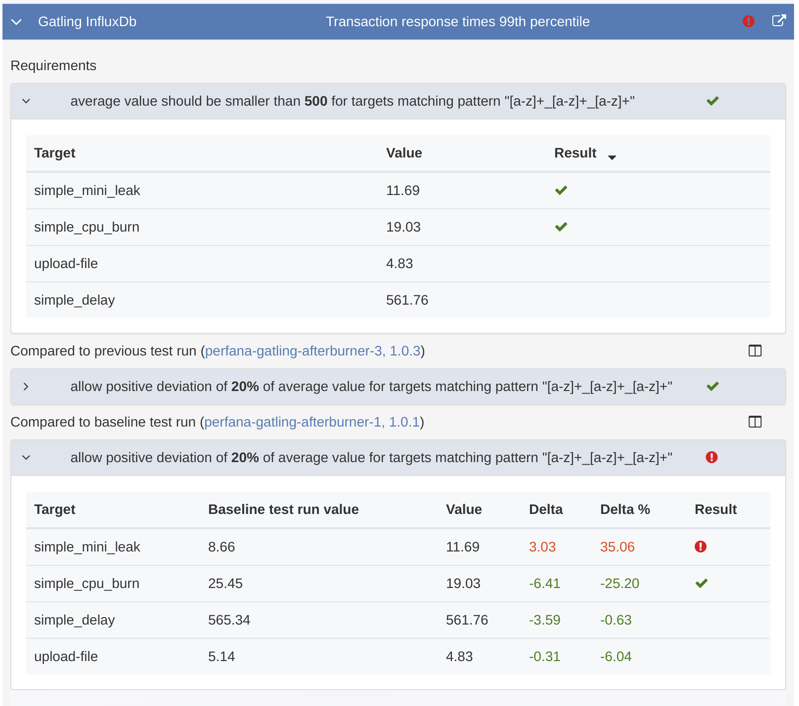
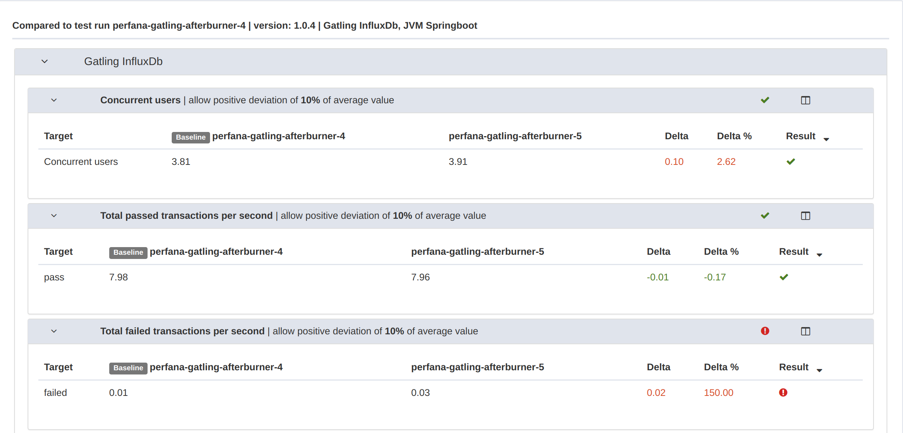

# Test run details
{: .no_toc }

## Table of contents
{: .no_toc .text-delta }

1. TOC
{:toc}

---

## Summary

The test run summary view has a number of sections

### Test run information

The test run information sections shows all the meta data for the test. It is possible to add annotations to the test run. If required, it is also possible to manually update the `Version` property by clicking it.

### Test properties

The test properties section shows all of the key-value pairs pairs passed by the performance test. This feature can for instance be used to describe a test setup used for the test.

### Check results

The check result section shows the requirements check results and, if applicable, checks on the delta's for key metrics between this and earlier test runs.

Exapnding the sections by clicking them will reveal more detailed information on the check results. See [Key metrics configuration](https://perfana.github.io/perfana-docs/docs/testconfiguration/testconfiguration.html#key-metrics)

### Alerts

If any [alerts](https://perfana.github.io/perfana-docs/docs/alerts/alerts.html) were triggered during the test they will be displayed in this section.

## Comments

In the comments tab, comments on the test are displayed. Comments can be added for selected graphs from this view, the `Key metrics` view or the `Dashboards` view and can be used to share knowledge among team members and/or other users.

## Key metrics

In this tab all configured key metrics graphs can be inspected in one overview. See [Key metrics configuration](https://perfana.github.io/perfana-docs/docs/testconfiguration/testconfiguration.html#key-metrics)

## Dashboards

In this tab all [Grafana dashboards](https://perfana.github.io/perfana-docs/docs/testconfiguration/testconfiguration.html#grafana-dashboards) linked to this tes can be viewed. Click on the header rows to expand or collapse the dashboards. Use the filter (accepts regular expressions) to display a subset of the dashboards only. 

## Report

If a [reporting template](https://perfana.github.io/perfana-docs/docs/testconfiguration/testconfiguration.html#reporting-template) was configured, the `Report` tab will be available. The report can be used to share test results with stakeholders by poviding a selection of relevant graphs with descriptions. The report will be generated automatically based on the configured reporting template. Default descriptions can be configured in the template and can edited for each test run if necessary. The report is automatically persisted by opening the report tab.

## Compare

When there are multiple test runs available with the samen `environment` and `workload` properties, the `Compare` tab will be available. The compare feature can be used to select another test run as baseline and compare all, or a selection of dashboards and metrics. The compare results are stored in the database for future reference.

To do a new comparison, click on `Compare`, this will launch the `Comparison wizard` that will guide you through the configuration steps:

### Select baseline test run
{: .no_toc }
Select test run to use as baseline. This can be any test run, executed prior to or after the current test run
### Select comparison type
{: .no_toc }
* Key metrics only: Compare configured key metrics only and use comparison thresholds as specified
* Custom: Select what dashboards and metrics to compare 

### Settings
{: .no_toc } 
* **Exclude ramp up time**: if checked, the configured ramp up time will be excluded when comapring the metrics
* **Average all metrics per panel**: When comparing, metrics are matched on the series names. Sometimes the series names contain dynamic parts that vary between test runs and cannot be mapped. In that case this option can be used as workaround. In that case an average over all series will be compared.
* **Metric aggregation**: configure what aggregation to use when comparing the metrics
* **Evaluate comparison results**: This option can be used to flag comparison results if they do need meet the specified condition. 

### Select dashboards
{: .no_toc } 
Select which Grafana dashboards to compare.
### Select panels
{: .no_toc }  
Select per dashboard what panels to compare.
### Save comparison results
{: .no_toc }  
Provide a description for the comparison result and click `Compare`

## Trends

When there are multiple test runs available with the samen `environment` and `workload` properties, the `Trends` tab will be available. This tab will display the trends for the configured key metrics over time. You can select a period (1 week only in the demo version, due to retention limits) and each test run is marked as a vertical line. When you hover the base of the line you can see the test run id and the version. From here you can deeplink into the test run details view.

## Manage

The `Manage` is only available for users that have a `team-admin` role for the team reponsible for the system under test and users with `admin` role. It has a number of sections for managing the test run:

* **Status**: displays the status for the different stages the test run will go through after it has finished. It also displays the expiry date for the test run. Read moren on test run expiry [here](https://perfana.github.io/perfana-docs/docs/administration/administration.html#data-retention-and-test-run-expiry)
* **Manage Grafana snapshots**: create, delete, update en view Grafana snapshots for the test run. To keep the snapshots from being deleted after the configured retention period, use `save snapshot`. If a report is generated for the test run (by opening the report tab), the snapshots are automatically saved.
* **Manage test run**:  This section can be used to delete a test run or to set it as `fixed baseline`. Users with the `admin` role are also allowed to edit the test run properties.
* **Manage checks**: This section can be used to manually re-evaluate the configured checks
* **Manage Report**: This section can be used to delete the persisted report