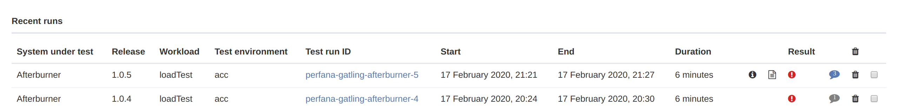
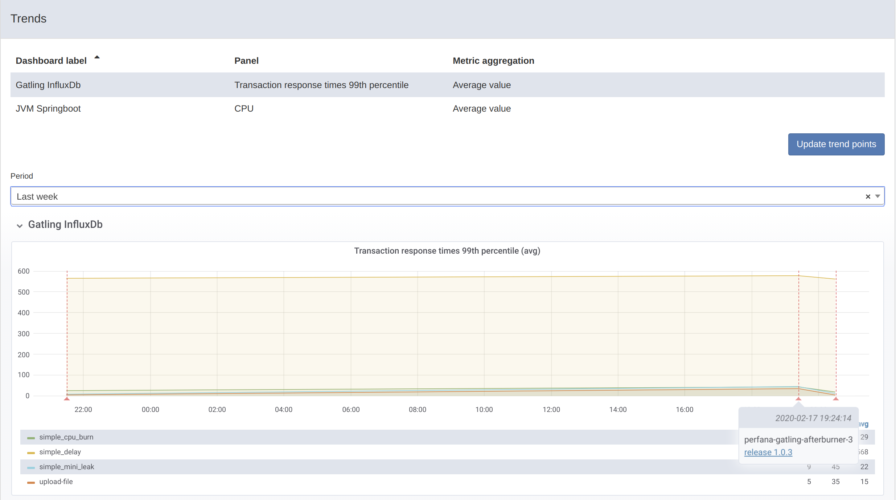

# Navigating test runs
{: .no_toc }

## Table of contents
{: .no_toc .text-delta }

1. TOC
{:toc}

---

{: .fs-6 }

## Landing page

After logging in the user is redirected to his or her personal landig page. It contains deeplinks to the `Test runs view` with preset filters on either the team(s) the user is member of or the systems under test that those teams are responsible for.

It also has a section called `Test runs that may require your attention` that will show test runs with failed checks not visited yet by the user.

In the top right of the screens there are notifications for the user that are created on several events, like test runs with failed checks and new comments on test runs.

## Test runs 

The `Test runs view` can be opened from the sidebar by clicking on the `rocket` icon.

### Test run selector
{: .no_toc }

The test run selector can be used to filter test runs based on test run properties `System under test`, `Test environment` and `Workload`. When the selector is switched to `team mode` a `Team` filter option is added.

### Running tests
{: .no_toc }

The `Running tests` section shows any currenty running tests matching the properties set in the `Test run selector`. 

Clicking on the test run will open the running test view. The view has two tabs:
* **Key metrics**: shows the configured key metrics for this test. See [Key metrics configuration](https://perfana.github.io/perfana-docs/docs/testconfiguration/testconfiguration.html#key-metrics)
* **Dashboard**: show the configured dashboards for this test. See [Grafana dashboards configuration](https://perfana.github.io/perfana-docs/docs/testconfiguration/testconfiguration.html#grafana-dashboards)

The Key metrics and Grafana dashboards can be configured via the items in the `settings` section in the sidebar.

### Recent runs
{: .no_toc }

The `Recent runs` section shows finished test runs matching the properties set in the `Test run selector` sorted on date. 

The table has a number of columns:

* Test run meta data like `System under test`, `Version`, `Workload`, `Test environment`, `Test run ID`, `Start`, `End` and `Duration`
* If annotations were added to the test run the `info` icon will be displayed, hover it to see the annotation.
* If a report has been persisted the `report` icon will be displayed, clicking the icon will deeplink to the report.
* If checks are configured for the test run, the consolidated result will be displayed in the `Result` column
* If the test run has comments, the number will be displayed in the `comments` icon. The icon will be blue when there are unread comments.
* If the user is allowed to delete test runs for the system under test, a `delete` icon will be available to delete the test run, or the checkboxes can be used to delete multiple test runs at once.

## Trends

When there are multiple test runs available with the same `environment` and `workload` properties, the `Trends` tab will be available. This tab will display the trends for the configured `key metrics` over time. You can select a period (1 week only in the demo version, due to retention limits) and each test run is marked as a vertical line. When you hover the base of the line you can see the test run id and the version. From here you can deeplink into the test run details view.

