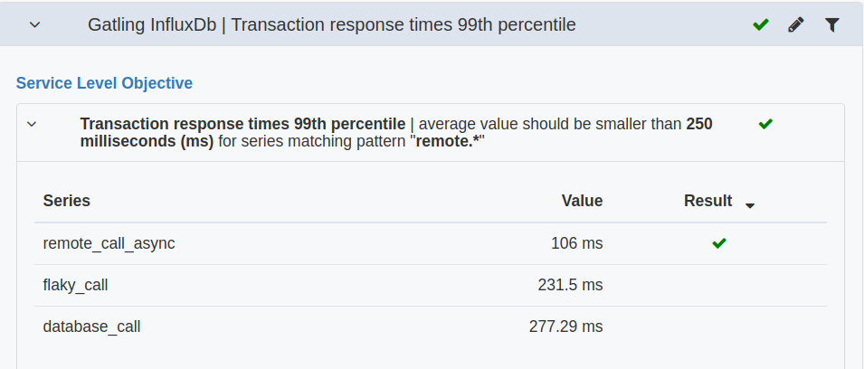

# Test run configuration
{: .no_toc }

## Table of contents
{: .no_toc .text-delta }

1. TOC
{:toc}

---

When a user has the `team-admin` role for a `team` that is responsible for  a `system under test`, the side bar in the `test runs view` will have a `settings` section.

In Perfana, test run configuration is set for a combination of test run properties. 

The `Grafana dashboards` linked to a test run are configured for a combination  of `System under test` and `Test environment` properties.

The `Key metrics` and `Reporting template` are configured for a combination  of `System under test`, `Test environment` and `Workload` properties.

Test run configuration can be set via [profiles](https://perfana.github.io/perfana-docs/docs/administration/administration.html#profiles-configuration) or manually.

## Grafana dashboards

It is possible to link any Grafana dashboard that is [registered in Perfana](https://perfana.github.io/perfana-docs/docs/administration/administration.html#grafana-configuration) to a test run. In order to add a dashboard click `Add dashboard` and the `Add Grafana dashboard` will be showed.

The form has the following fields:
* **System under test**
* **Test environment**
* **Grafana**: select Grafana instance than
* **Dashboard name**: Select Grafana dashboard
* **Dashboard label**: Add descriptive label, e.g. "Host metrics webserver 1"
* **Variables**: If the Grafana dashboard has [templating values](https://grafana.com/docs/grafana/latest/reference/templating/), set variables and one or more values.

## Key metrics  

When one or more Grafana dashboard have been linked to the test runs, it is possible to select metrics from these dashboards as `key metrics`. 

--- 

> Key metrics are set on `workload` level, so this item in the sidebar will be active only when the `workload` property in the `Test run selector` has been set.

--- 
Key metrics can be optionally configured to be automatically assessed after a test run has finished. The results can then be used to act as a `quality gate` when runing tests from a CI/CD pipeline. See [Setting up Perfana as quality gate](https://perfana.github.io/perfana-docs/docs/administration/ci-cd.html#quality-gate)

Two types of checks can be configured for a `key metric`:
* **Requirement**: Check if the `key metric` value is `greater than` or `smaller than` a specified value. An example check would be "Average CPU usage should be smaller than 70%" or "Maximum throughput should be higher than 1000 (rps)"
* **Comparison**: Check if the `delta` between test runs is within allowed thresholds. Example: "Allow a positve deviation of 20% between test runs for the 99th percentile response times"

If `key metrics` have been configured via [profiles](https://perfana.github.io/perfana-docs/docs/administration/administration.html#profiles-configuration) they can't be edited or removed. These `key metrics` will display the originating `profile` in the last column of the table.

### Add key metric
{: .no_toc }

To add a key metric, click `Add metric`. This will open the `Add Key Metric` form.

The form has the following fields:
* **System under test**
* **Workload**
* **Test environment**
* **Grafana**: select Grafana instance
* **Dashboard label**: Select dashboard to select metric from
* **Panel**: Select [panel](https://grafana.com/docs/grafana/latest/features/panels/panels/). Currently only [graph panels](https://grafana.com/docs/grafana/latest/features/panels/graph/) can be used as key metric.
* **Exclude ramp up time when evaluating test run**: When this option is checked the configured `rampUpTime` will be excluded from evaluation data.
* **Average all panel series when comparing test runs**: if this option is checked all series produced by the panel will be averaged before evaluating the data.
* **Evaluate**: select the aggregation to be used on the data when evaluating: `Average` (default), `Maximum`, `Minimum` or `Last`
* **Only apply to metrics matching regex pattern**: a panel could produce multiple series. A regular expression can be provided to filter the series that the configured checks apply to, e.g.

* **Requirement**: the requirment to check
* **Comparison**: the allowed deviation between test run 
* **Update existing test runs**: if checked, the checks will be evaluated for all existing test runs with matching `System under test`, `Test environment` and `Workload` properties.

## Reporting template 

--- 

> The `reporting template` is set on `workload` level, so this item in the sidebar will be active only when the `workload` property in the `Test run selector` has been set. 

--- 

Perfana can produce a test run report can be used to share test results with stakeholders by poviding a selection of relevant graphs with descriptions. The report will be generated automatically based on the configured reporting template. 

To add a `panel` to the report template click the `Add panel` button. This will open the `Add report panel` form, with the following fields:

* **System under test**
* **Workload**
* **Test environment**
* **Grafana**: select Grafana instance
* **Dashboard label**: Select dashboard to select metric from
* **Panel**: Select [panel](https://grafana.com/docs/grafana/latest/features/panels/panels/). 
* **Annotation**: add a default annotation to be displayed next to the graph

## Abort alert tags 

--- 

> The `abort alert tags` are set on `workload` level, so this item in the sidebar will be active only when the `workload` property in the `Test run selector` has been set. 

--- 